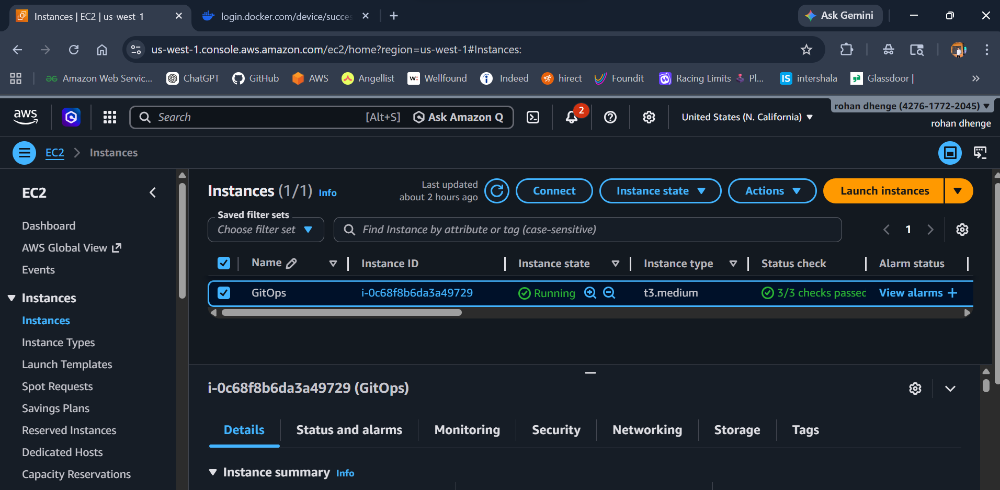
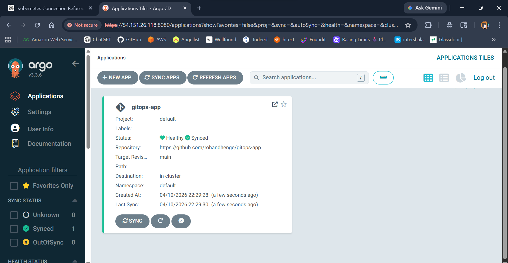
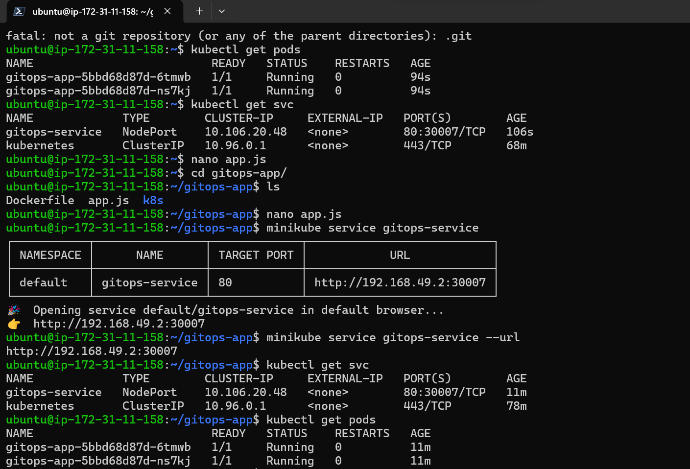

# 🚀 GitOps-Based Kubernetes Deployment using ArgoCD

## 📌 Project Overview

This project implements a **GitOps-based deployment pipeline** using ArgoCD, where all Kubernetes deployments are managed via Git.

> ❗ No manual `kubectl apply` in production
> ✅ All deployments happen via Git commits

---

# 🧱 Architecture Diagram

```id="arch123"
        +-------------+
        | Developer   |
        +-------------+
               |
               v
        +-------------+
        |  GitHub     |
        | (Source of  |
        |  Truth)     |
        +-------------+
               |
               v
        +-------------+
        |   ArgoCD    |
        | (GitOps CD) |
        +-------------+
               |
               v
        +-------------+
        | Kubernetes  |
        |  Cluster    |
        +-------------+
               |
               v
        +-------------+
        | Application |
        +-------------+
```



---


# 📦 Deliverables

## 1️⃣ Dockerfile

Used to containerize the application.

```dockerfile id="dock123"
FROM node:18
WORKDIR /app
COPY . .
RUN npm init -y
EXPOSE 3000
CMD ["node", "app.js"]
```

---

## 2️⃣ Kubernetes YAML

### 🔹 Deployment

```yaml id="dep123"
apiVersion: apps/v1
kind: Deployment
metadata:
  name: gitops-app
spec:
  replicas: 2
  selector:
    matchLabels:
      app: gitops-app
  template:
    metadata:
      labels:
        app: gitops-app
    spec:
      containers:
      - name: gitops-app
        image: rohan2885/gitops-app:v1
        ports:
        - containerPort: 3000
```

---

### 🔹 Service

```yaml id="svc123"
apiVersion: v1
kind: Service
metadata:
  name: gitops-service
spec:
  type: NodePort
  selector:
    app: gitops-app
  ports:
    - port: 80
      targetPort: 3000
      nodePort: 30007
```

---

## 3️⃣ ArgoCD Configuration

* Application Name: `gitops-app`
* Repository: https://github.com/rohandhenge/gitops-app
* Path: `k8s`
* Cluster: Default Kubernetes cluster
* Namespace: `default`

### 🔹 Auto Sync Enabled:

* ✅ Automatic Sync
* ✅ Self Heal
* ✅ Prune Resources

---

## 4️⃣ GitHub Repository


```
https://github.com/rohandhenge/gitops-app
```

---

# ⚙️ Setup & Execution Steps

## 🔹 Clone Repo

```bash id="clone123"
git clone https://github.com/rohandhenge/gitops-app
cd gitops-app
```

---

## 🔹 Build & Push Docker Image

```bash id="docker123"
docker build -t rohan2885/gitops-app:v1 .
docker push rohan2885/gitops-app:v1
```

---

## 🔹 Start Kubernetes Cluster

```bash id="mini123"
minikube start
```

---

## 🔹 Install ArgoCD

```bash id="argo123"
kubectl create namespace argocd
kubectl apply -n argocd -f https://raw.githubusercontent.com/argoproj/argo-cd/stable/manifests/install.yaml
```

---

## 🔹 Access ArgoCD UI

```bash id="ui123"
kubectl port-forward svc/argocd-server -n argocd 8080:443 --address 0.0.0.0
```

---

## 🔹 Get Admin Password

```bash id="pass123"
kubectl get secret argocd-initial-admin-secret -n argocd -o jsonpath="{.data.password}" | base64 --decode
```

---

# 🔄 GitOps Workflow

1. Developer modifies code
2. Builds & pushes Docker image
3. Updates image tag in deployment.yaml
4. Pushes changes to GitHub

```bash id="git123"
git add .
git commit -m "updated version"
git push
```

👉 ArgoCD automatically detects changes and deploys 🚀


---


# 🌐 Access Application

```bash id="app123"
kubectl port-forward svc/gitops-service 30007:80 --address 0.0.0.0
```

Open:

```
http://54.151.26.118:30007
```



---

# 📊 Verification

```bash id="verify123"
kubectl get pods
kubectl get svc
```



---

# 💡 Key Features

* Git as single source of truth
* Automated deployment using ArgoCD
* No manual intervention
* Self-healing infrastructure
* Continuous delivery

---

# 🙌 Author

**Rohan Dhenge**
